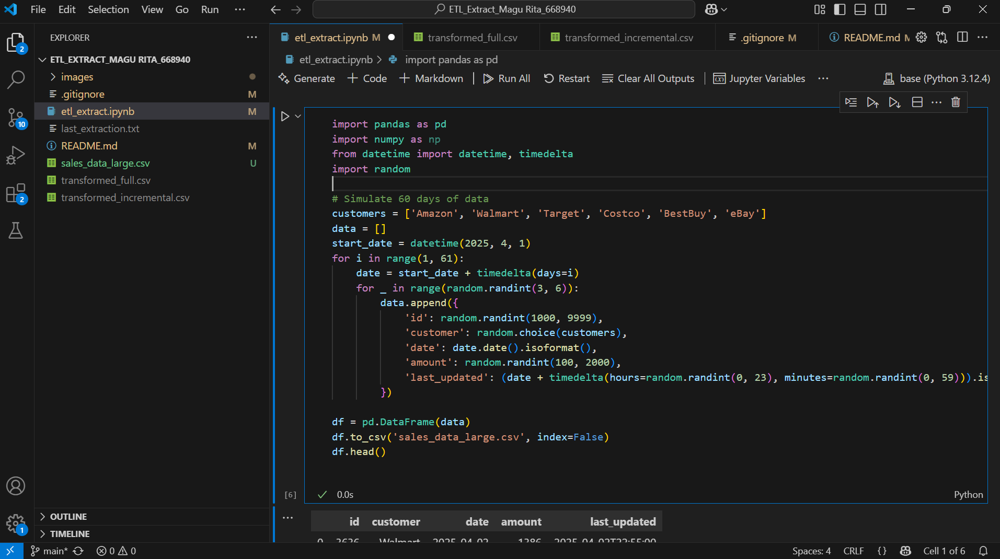
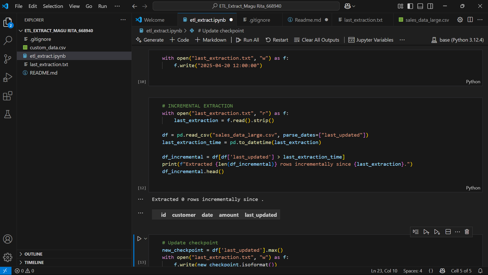
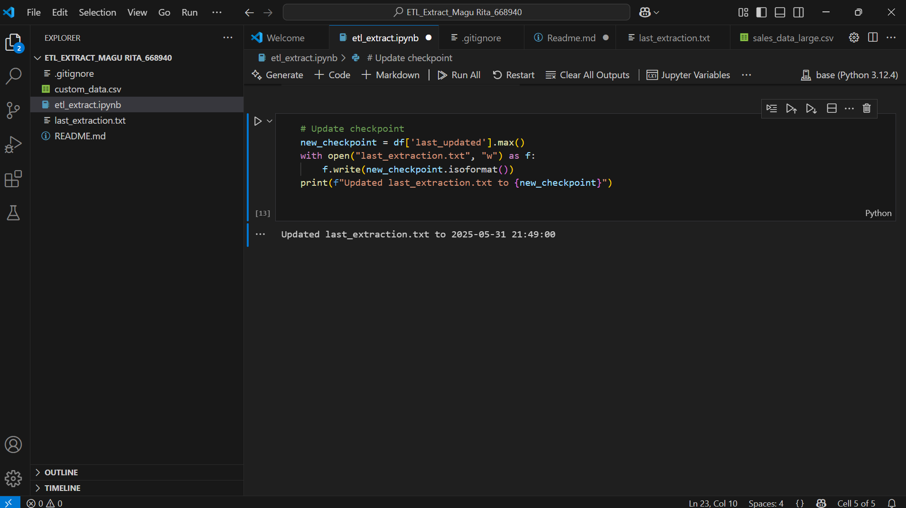
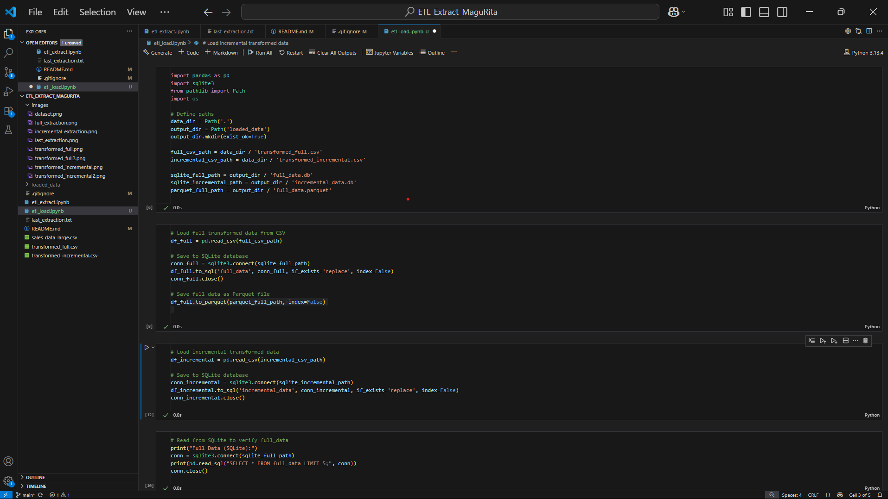
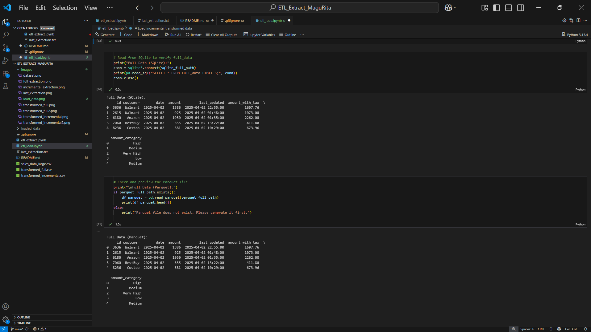
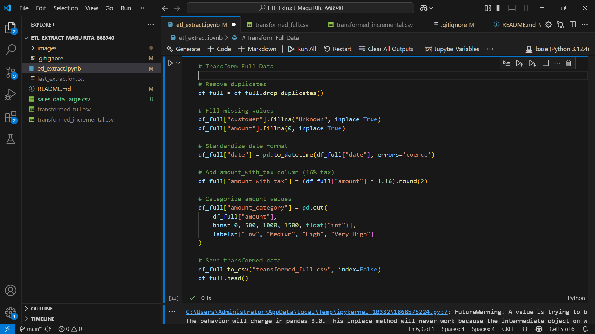
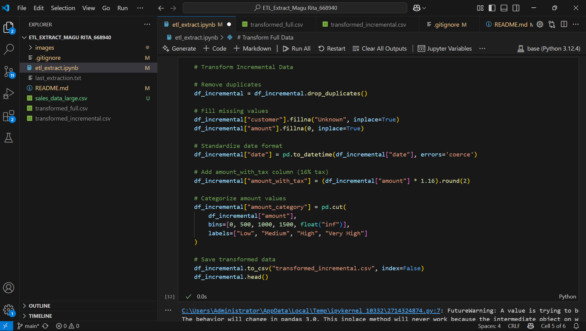
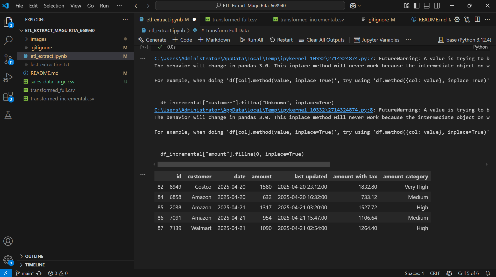

# ETL Extract Lab 

**MAGU RITA** 

## Project Description
This project demonstrates full and incremental extraction techniques in ETL processes using a realistic, time-stamped sales dataset. It includes data cleaning, transformation, categorization, file-based timestamp tracking and loading into structured destinations to simulate real-world ETL workflows.

## Project Structure
ETL_Extract_MaguRita

\etl_extract.ipynb\ – Jupyter notebook with ETL implementation

\etl_load.ipynb\ – Jupyter notebook for loading cleaned data into SQLite and Parquet formats

\custom_data.csv\ – Generated sales dataset (300+ records)

\last_extraction.txt\ – Timestamp tracker for incremental loads

\transformed_full.csv\ – Cleaned and categorized dataset from full extraction

\transformed_incremental.csv\ – Cleaned and categorized new records from incremental extraction

\loaded_data\ – Folder containing `.db` and `.parquet` output files from the load phase

\ .gitignore\ – Specifies files to ignore in version control

\README.md\ – Project documentation

## Tools Used
- Python 3
- pandas
- sqlite3
- pyarrow (for Parquet support)
- Jupyter Notebook
- datetime
- os
- pathlib

## How to Run

### Phase 1: Extraction & Transformation
1. Install dependencies:  
   `pip install pandas jupyter`
2. Open the notebook:  
   `jupyter notebook etl_extract.ipynb`
3. Run all cells to:
   - Generate dataset

   - Perform full extraction and transformation

   - Perform incremental transformation based on timestamp

### Phase 2: Load
1. Install extra dependency:  
   `pip install pyarrow` *(for Parquet support)*
2. Open the load notebook:  
   `jupyter notebook etl_load.ipynb`
3. Run the following steps:
   - Load transformed data into SQLite databases (`full_data.db`, `incremental_data.db`)
   - Save full dataset to `full_data.parquet`
   - Preview and verify successful loading

## Key Features

### 1. Full Extraction
- Reads all records from `sales_data_large.csv`
- Removes duplicates
- Adds derived column: **Sales Category** (`Low`, `Medium`, `High`)
- Outputs to `transformed_full.csv`
- Prints record count and sample output

### 2. Incremental Extraction
- Reads `last_extraction.txt` to filter only new rows
- Applies same deduplication and categorization logic
- Outputs to `transformed_incremental.csv`
- Updates timestamp tracker

### 3. Categorization Logic
- **Low**: Amount < 500  
- **Medium**: 500 ≤ Amount < 1500  
- **High**: Amount ≥ 1500

### 4. Loading 
- Loads transformed data into SQLite databases (`.db`)
- Saves full data as a Parquet file (`.parquet`)
- Provides verification by reading from SQLite and Parquet

## Dataset Details
- File: `sales_data_large.csv`
- Contains 2 months of simulated sales data (April–May 2025)
- 6 major customers (Amazon, Walmart, Target, etc.)
- 3–6 transactions per day
- Random amounts ($100–$2000 range)
- Precise timestamps for each transaction

## Expected Outputs

### Full Extraction
Extracted 275 rows fully  

### Incremental Extraction
Extracted 192 rows incrementally since `2025-04-20 12:00:00`.

### Log File
`last_extraction.txt` contains the timestamp of the latest row processed.
Updated last_extraction.txt to `2025-05-31 23:12:00`

### Load Outputs 
- SQLite:
  - `loaded_data/full_data.db`
  - `loaded_data/incremental_data.db`
- Parquet:
  - `loaded_data/full_data.parquet`
- Preview confirms correct structure and data integrity

