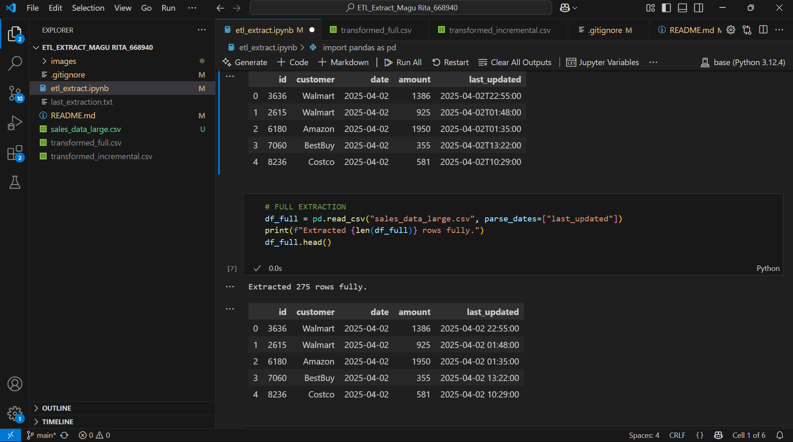
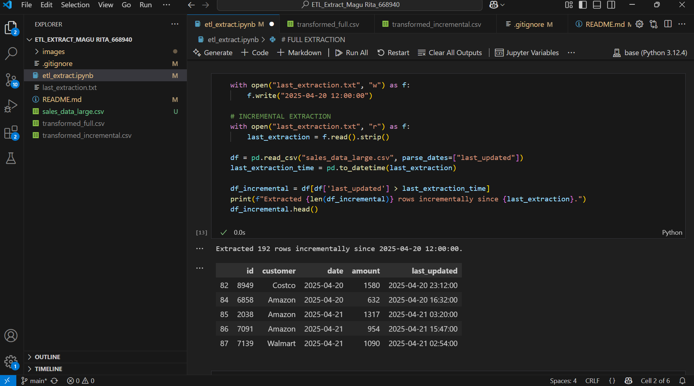
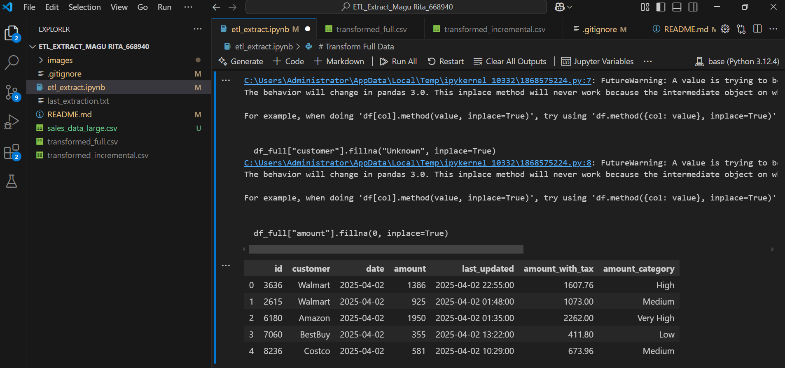

# ETL Extract Lab 

**MAGU RITA**  
**ID NO: 668940**

## Project Description
This project demonstrates full and incremental extraction techniques in ETL processes using a realistic, time stamped sales dataset. It includes data cleaning, transformation, categorization and file based timestamp tracking to simulate real world ETL workflows.

## Project Structure
ETL_Extract_MaguRita_668940

\etl_extract.ipynb\ Jupyter notebook with ETL implementation

\custom_data.csv\ Generated sales dataset (300+ records)

\last_extraction.txt\ Timestamp tracker for incremental loads

\transformed_full.csv\ Cleaned and categorized dataset from full extraction

\transformed_incremental.csv\ Cleaned and categorized new records from incremental extraction

\ .gitignore\ Specifies files to ignore in version control

\README.md\ Project documentation

## Tools Used
- Python 3
- pandas
- Jupyter Notebook
- datetime
- os

## How to Run
1. Install dependencies: `pip install pandas jupyter`

2. Open the notebook: `jupyter notebook etl_extract.ipynb`

3. Run the notebook cells sequentially**
   - First cell generates the dataset
   - Second cell demonstrates full extraction
   - Third cell shows incremental extraction
   - Fourth cell reads the last extraction timestamp
   - Fifth cell demonstrates full extraction (cleansing and categorization)
   - Last cell performs incremental extraction (only new records)
   

## Key Features
1. Full Extraction
- Reads all records from `sales_data_large.csv`
- Removes duplicates
- Adds a derived column: **Sales Category** (`Low`, `Medium`, `High`)
- Saves cleaned output to `transformed_full.csv`
- Prints record count and sample output

2. Incremental Extraction
- Reads `last_extraction.txt` to filter only new rows
- Applies the same deduplication and categorization
- Outputs to `transformed_incremental.csv`
- Updates the timestamp to latest record loaded

3. Categorization Logic
- **Low**: Amount < 500  
- **Medium**: 500 ≤ Amount < 1500  
- **High**: Amount ≥ 1500

## Dataset Details
- File: `sales_data_large.csv`
- Contains 2 months of simulated sales data (April-May 2025)
- 6 major customers (Amazon, Walmart, Target, etc.)
- 3-6 transactions per day
- Random amounts ($100-$2000 range)
- Precise timestamps for each transaction

## Expected Outputs
1. **Full Extraction**
   Extracted 275 rows fully
 

2. **Incremental Extraction**
   Extracted 192 rows incrementally since 2025-04-20 12:00:00.
   

3. **Log File**
   `last_extraction.txt` contains the timestamp of the latest row processed for incremental runs.
   Updated last_extraction.txt to 2025-05-31 23:12:00

 
 ## Screenshots

*Dataset generation*

*Full extraction* 

*Incremental extraction*

*Last extraction timestamp file*

*Transformed full extraction*

*Transformed incremental extraction*
