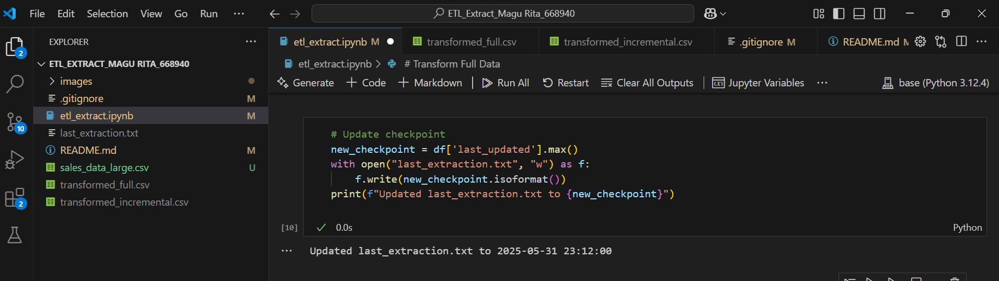

# ETL Extract Lab 

MAGU RITA  
ID NO: 668940

## Project Description
This project demonstrates Full and Incremental extraction techniques in ETL processes using a simulated sales dataset.

## Project Structure
ETL_Extract_MaguRita_668940

\etl_extract.ipynb\ Jupyter notebook with ETL implementation

\sales_data_large.csv\ Generated sales dataset (300+ records)

\last_extraction.txt\ Timestamp tracker for incremental loads

\.gitignore\ Specifies files to ignore in version control

\README.md\ Project documentation

## Tools Used
- Python 3
- pandas
- Jupyter Notebook

## How to Run
1. Install dependencies: `pip install pandas jupyter`
2. Open the notebook: `jupyter notebook etl_extract.ipynb`
3. Run cells sequentially:
   - First cell generates the dataset
   - Second cell demonstrates full extraction
   - Third cell shows incremental extraction

## Key Features
1. Full Extraction:
   - Loads entire dataset each time
   - Simple but resource-intensive
   - Outputs all records with basic statistics

2. Incremental Extraction:
   - Only loads new/updated records
   - Uses `last_extraction.txt` as checkpoint
   - Updates timestamp after successful extraction

## Dataset Details
- Contains 2 months of simulated sales data (April-May 2025)
- 6 major customers (Amazon, Walmart, Target, etc.)
- 3-6 transactions per day
- Random amounts ($100-$2000 range)
- Precise timestamps for each transaction

## Expected Outputs
1. Full extraction: "Extracted [X] rows fully" with sample data
2. Incremental extraction: "Extracted [Y] new rows since [timestamp]"
3. Automatic update of last_extraction.txt
 
 ## Screenshots

*Dataset generation output*

*Full extraction results* 

*Incremental extraction output*

*Last extraction timestamp file*

